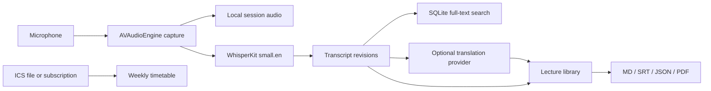

<div align="center">

# EchoNote 声译

**让英语课堂变成可检索、可回看、可引用的双语学习资料。**

A native macOS lecture companion for live English transcription, Simplified Chinese translation, timetable planning, evidence-linked notes, and private local archiving.

[](https://www.swift.org/)
[](https://www.apple.com/macos/)
[](https://github.com/eason241008/EchoNote/actions/workflows/swift.yml)
[](LICENSE)

</div>

> [!IMPORTANT]
> EchoNote is a study tool, not a covert recorder. Obtain consent and follow your institution's rules before recording any class. The app requires an explicit acknowledgement before recording starts.

## Why EchoNote

Fast English lectures are difficult to follow when listening, translating, and taking notes compete for attention. EchoNote keeps those jobs in one native workspace:

- **English-first live captions** powered locally by WhisperKit.
- **Optional Simplified Chinese translation** through your own OpenAI-compatible endpoint.
- **Editable transcript timeline** with revision history instead of destructive text replacement.
- **Evidence-linked study notes** that point back to transcript revisions.
- **Searchable lecture library** with bookmarks, questions, key concepts, and exports.
- **Weekly timetable** imported from a standard ICS subscription, with Melbourne timezone handling.

## Product Tour

| Record | Timetable |
| --- | --- |
| Live waveform, English transcript, Chinese translation, recording controls, and a detachable caption window. | Weekly grid, ICS import/sync, course location, and automatic startup refresh. |

| Library | Settings |
| --- | --- |
| Full-text search across transcripts, translations, notes, and bookmarks; export to Markdown, SRT, JSON, or PDF. | Local model status, retention policy, translation provider import, timetable URL, storage location, and local data controls. |

## Features

### Live lecture capture

- Explicit preflight checks for microphone permission, selected input device, local model availability, and recording-policy acknowledgement.
- Local 16 kHz audio capture and streaming transcription.
- Partial captions followed by finalized segments; bounded async streams keep capture latency stable.
- Pause, resume, stop, interruption recovery, and persisted session manifests.
- A compact always-on-top caption window for following the lecture while another app is active.

### Bilingual captions

- English ASR remains the source of truth.
- Optional English-to-Simplified-Chinese translation uses `POST /chat/completions` with a JSON response contract.
- Terminology-aware batching and ordered output preserve segment alignment.
- API credentials are stored in macOS Keychain; provider metadata stays in UserDefaults.
- Translation failures do not stop local recording or English transcription.

### Lecture library and study evidence

- SQLite-backed sessions, transcript revisions, translations, bookmarks, notes, and search index.
- Manual transcript edits create new revisions; previous text remains auditable.
- Search results include timestamps and source-revision references.
- Notes and exports keep evidence links to the transcript revision used to create them.
- Retention policy supports immediate cleanup, bounded day counts, or indefinite retention.

### Timetable

- Import a local `.ics` file or save an HTTPS ICS subscription URL.
- Recurring events expand into the weekly grid while preserving stable event identity.
- `TZID` values such as `Australia/Melbourne` are respected.
- The last successful calendar remains available offline.

## Requirements

| Requirement | Minimum |
| --- | --- |
| macOS | 15.0 Sequoia |
| Hardware | Apple Silicon recommended |
| Xcode | 16.0 or newer |
| Swift | 5.9 toolchain or newer |
| Disk | About 500 MB for the default `Whisper small.en` model, plus recordings |
| Network | Initial dependency/model download, Apple language download, and ICS sync |

EchoNote uses Apple's on-device Translation framework for English-to-Simplified-Chinese captions. Translation content stays on the Mac; the system may ask before downloading the required language models.

EchoNote uses [Argmax Open-Source SDK / WhisperKit](https://github.com/argmaxinc/argmax-oss-swift) `1.0.0` for local English transcription.

## Quick Start

```bash
git clone https://github.com/eason241008/EchoNote.git
cd EchoNote
swift package resolve
swift build
swift test
swift run EchoNote
```

The first production recording also needs the `Whisper small.en` Core ML model. In the app, open **Settings → Local model** and download it. The model is validated before recording is enabled.

### Build a macOS app bundle

```bash
swift build-app.swift
open dist/EchoNote.app
```

This creates an ad-hoc-signed `dist/EchoNote.app` with the project entitlements. For distribution to other Macs, replace ad-hoc signing with your Developer ID certificate and notarize the bundle.

## Configuration

### 1. Microphone and recording policy

On first use:

1. Allow microphone access when macOS asks.
2. Select an available input device.
3. Read and acknowledge the recording policy.
4. Start a prepared lecture session explicitly.

EchoNote never starts recording merely because the app launches or a scheduled class begins.

### 2. Local speech model

The current production pipeline uses English-only `Whisper small.en`:

- Estimated download: approximately 500 MB.
- Inference: local Core ML through WhisperKit.
- Model storage: `~/Library/Application Support/EchoNote/Models/`.
- Recording is blocked until model validation succeeds.

This model favors English lecture transcription speed and accuracy. Multilingual source transcription is not enabled in the current production path.

### 3. Translation provider

Translation is optional. EchoNote imports one provider from an [Oh My Pi](https://github.com/can1357/oh-my-pi) `models.yml` file so the endpoint and credential do not need to be pasted into the UI.

A compatible provider entry contains:

```yaml
providers:
  openai:
    baseUrl: https://api.example.com/v1
    apiKey: YOUR_API_KEY
```

In **Settings → Translation service**:

1. Enter the provider ID used in `models.yml` (for example, `openai`).
2. Enter a model supported by that endpoint.
3. Import the file.

EchoNote stores the API key in macOS Keychain and calls `<baseUrl>/chat/completions`. The endpoint must accept OpenAI-compatible chat-completion requests and JSON response formatting.

> [!CAUTION]
> Never commit a real `models.yml`, API key, timetable token, recording, or exported lecture data. The repository ignore rules intentionally exclude build output and local environment files, but secrets outside ignored paths remain your responsibility.

### 4. Timetable subscription

In **Settings → Timetable subscription**, paste your own HTTPS ICS URL and choose **Save and sync**. You can also import a local `.ics` file from the timetable page.

Subscription URLs can contain private tokens. They remain in local UserDefaults and are not part of this repository.

## Data and Privacy

EchoNote is local-first:

- Audio, manifests, SQLite data, models, and exports live under `~/Library/Application Support/EchoNote/` unless you choose another export location.
- Audio capture and English transcription run on-device.
- Only finalized English text is sent to the translation endpoint you configure.
- Provider API keys are stored in macOS Keychain.
- ICS sync contacts only the subscription URL you provide.
- No analytics or telemetry client is included.

If an older local build used `~/Library/Application Support/课堂伴侣/`, EchoNote moves that directory to the new data location on first launch when no EchoNote directory exists.

## Architecture



Key boundaries:

- `AVFoundationCapture.swift` — microphone device discovery and audio frames.
- `LiveTranscription.swift` — WhisperKit streaming recognition.
- `TranslationPipeline.swift` — batching, terminology, ordering, and provider requests.
- `LectureDatabase.swift` and repositories — durable SQLite data and migrations.
- `CaptionWorkspace.swift` — independent caption, translation, and display state.
- `Scheduling.swift` and `WeeklyTimetableView.swift` — ICS parsing and timetable UI.
- `AppSurfaceModels.swift` — production library, search, export, and settings models.

## Development

Run the complete suite:

```bash
swift test
```

Run focused suites while iterating:

```bash
swift test --filter LiveTranscriptionTests
swift test --filter TranslationPipelineTests
swift test --filter SchedulingTests
swift test --filter AppSurfaceModelsTests
```

The suite covers database migrations and rollback, session lifecycle, bounded streams, capture timelines, prompt behavior, translation ordering, ICS recurrence/timezones, search correction, retention, exports, Keychain importer behavior through test stores, and real microphone/provider flow behind environment gates.

Optional hardware/provider validation uses environment variables defined by `RealLectureFlowTests.swift`; it is skipped unless explicitly enabled.

## Current Limitations

- Source speech recognition is English-only in the production path.
- Translation requires a separately configured OpenAI-compatible service and may incur provider cost.
- Speaker diarization is not implemented.
- The repository does not publish a notarized binary yet; build locally with the provided script.
- Recording legality and institutional consent remain the user's responsibility.

## Contributing

Issues and focused pull requests are welcome. Before submitting a change:

1. Keep user data and credentials out of fixtures and logs.
2. Preserve revision history and evidence links when changing transcript behavior.
3. Add or update a behavioral test for observable contract changes.
4. Run `swift build` and `swift test` on macOS 14+ with Xcode 16+.

## Acknowledgements

- [WhisperKit / Argmax Open-Source SDK](https://github.com/argmaxinc/argmax-oss-swift) for on-device speech recognition on Apple Silicon.
- [OpenAI Whisper](https://github.com/openai/whisper) for the underlying speech-recognition model family.
- [Oh My Pi](https://github.com/can1357/oh-my-pi) for the optional provider-configuration import format.

## License

EchoNote is available under the [MIT License](LICENSE).
